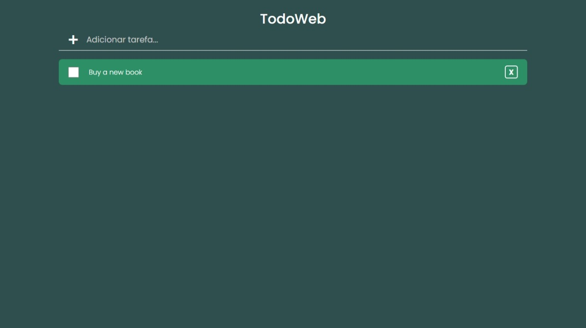

# TODOWEB

## Tecnologias

- REACT JS
- JAVASCRIPT
- CSS

## Visualização

TODOWEB: <a href="http://todoweb-kohl.vercel.app/">http://todoweb-kohl.vercel.app</a>

## Licença

Esse projeto está sob a licença MIT. Veja o arquivo [LICENSE](LICENSE) para mais detalhes.
